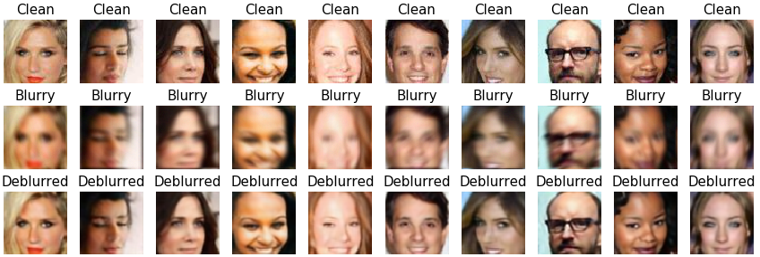

# CNN-For-End-to-End-Deblurring
Trained an End-to-End model for deblurring of images (CelebA) following the work in [CNN For Direct Text Deblurring](http://www.fit.vutbr.cz/research/pubs/index.php.en?file=%2Fpub%2F10922%2Fhradis15CNNdeblurring.pdf&id=10922).
The first layer filter size is adjusted to be approximately equal to the blur kernel size. Pre-Trained model with weights and some images from test set are uploaded.

